## 引子
那一天看到了Adobe的黑科技。

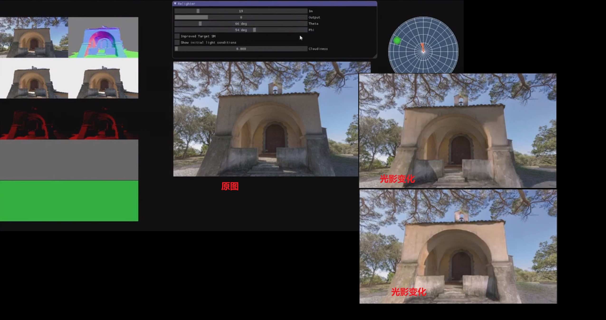


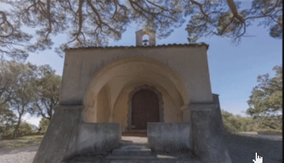

弹幕里一片震惊，纷纷感慨卧槽。我就淡定多了，这一看不就是机器学习生成法线图和深度图，然后向量模拟光照计算嘛。不过如此（酸了酸了）。


> PS：机器学习+shader是我猜测的，实际工程肯定是需要更多细节，包括去除背景，去除原始光照。而且研究项目和实际工程项目差距很大，实际工程需要更多的优化和稳定性。除了大的算法，还需要很多策略性的细节。换句话说，从demo到产品，工程师和研究者要迈过更多的坑，牺牲更多的头发。这里对黑科技的工作者表示深深的敬意。


## 想法
啊，我也想搞黑科技。

看着眼前的1060，流下了没钱的泪水。
但身为一个Geek，没钱也不能阻止我折腾的手。
但光有手也是不行的啊，机器学习，训练集才是爸爸。
有训练集是alpha go，没训练集是阿尔法狗。（从0训练的那是alpha zero）


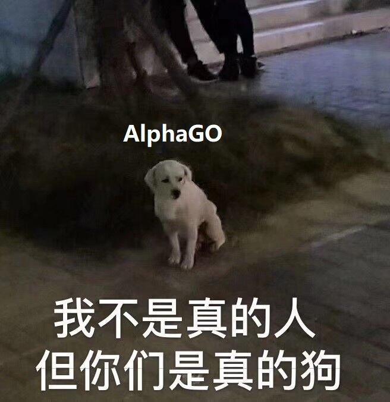


但身为一个Geek，没训练集也不能阻止我折腾的心。
一个想法在我脑海凌空出世。
用unity来造爸爸啊。
嗯，用unity来生成训练集。
## 实现
我立刻打开了AssetStore（unity的菜市场）
搜索city。


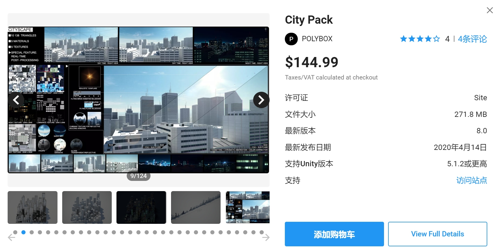

划掉划掉。
搜索city+Free。


很好，这个就是我们需要的了。

然后进入unity，导入并打开下载下来的城市示例场景。

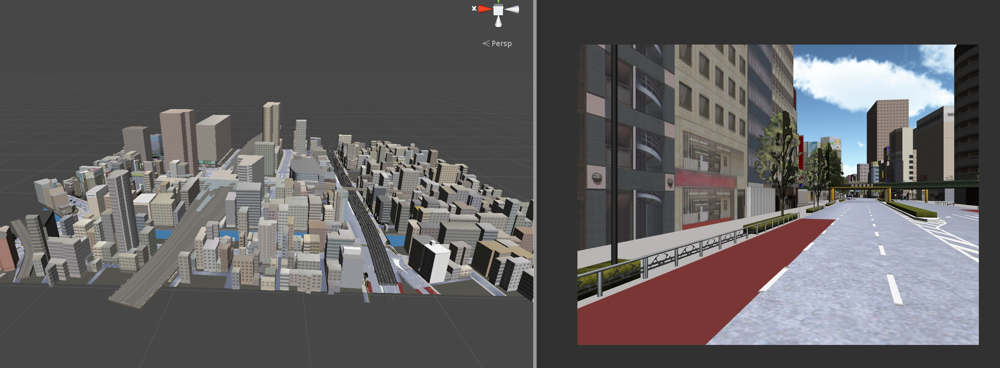


接下来就是截屏了，最好的方式是用针对camera的全局shader去获取视野范围中的法线和深度图，但我在做这个的时候对shader不是很熟，就用了更简单的Physics.Raycast去判断深度。
简单来说，就是人眼发射一束激光，激光在照射到障碍物时停下，这激光的距离就是眼睛与障碍物的距离，也就是我要的深度。多束激光就代表了多个像素。


获取深度的函数就是上文提到的Physics.Raycast。
```cs
public Texture2D GetDepth()
    {
        Texture2D depth= new Texture2D(m_targetWidth, m_targetHeight, TextureFormat.RGB24, false);
        RaycastHit hit;

        //float maxDistance = 500f;
        float maxDistance = m_mainCamera.farClipPlane;
        Debug.Log(maxDistance);
        for (int x = 0; x < m_targetWidth; ++x)
            for (int y = 0; y < m_targetHeight; ++y)
            {
                float _x = (x + 0f) / m_targetWidth * Screen.width;
                float _y = (y + 0f) / m_targetHeight * Screen.height;
                Ray look = m_mainCamera.ScreenPointToRay(new Vector3(_x,_y,0));
                Color color = Color.white;
                if (Physics.Raycast(look, out hit, maxDistance))
                {
                    color = Color.white * hit.distance / maxDistance;
                }
                depth.SetPixel(x, y, color);
            }
        return depth;
    }
```
另外，Physics.Raycast要求目标对象有Collider组件。为了方便，用了一个函数递归去添加组件。在新的unity里，你也可以用ctrl+右箭头展开对象树，再统一添加组件。
```cs
void func(GameObject obj)
    {
        if (obj.GetComponent<MeshCollider>() == null)
            obj.AddComponent<MeshCollider>();
        foreach(Transform child in obj.transform)
        {
            func(child.gameObject);
        }
    }
```
然后就是在Unity中循环的采集图片啦。
我是直接手动在城市里转圈，你也可以写个自动转圈的代码。

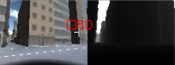

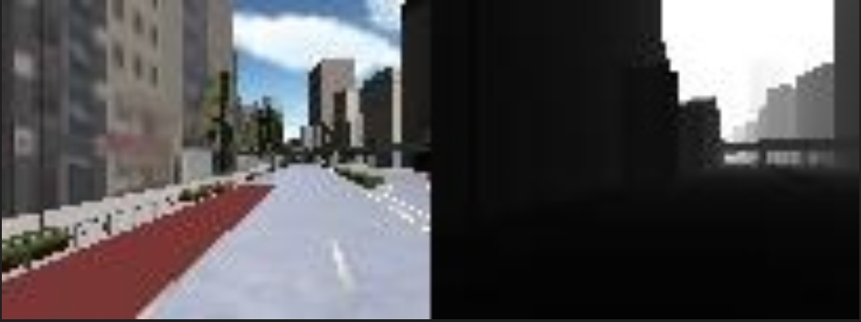


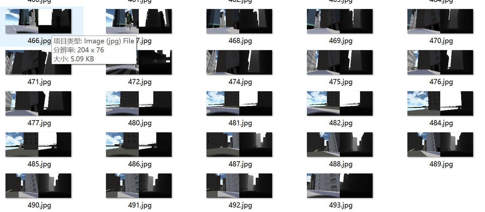

像这样的样本，大约弄了500个。
500个是因为我机器学习选的[pix2pix](https://github.com/affinelayer/pix2pix-tensorflow )。它一个示例的训练集[CMP Facades dataset](http://cmp.felk.cvut.cz/~tylecr1/facade/)就是采用大约500个样本。

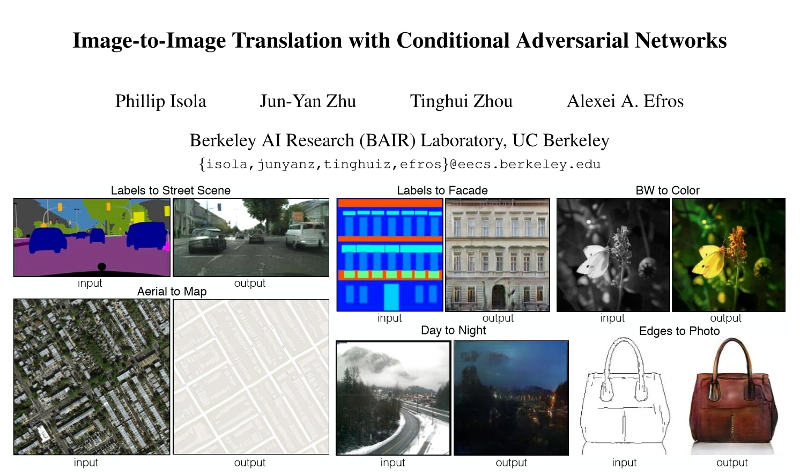


然后就无脑丢进去，修改下参数，直接跑python程序。训练了大约一上午。
## 结果
早上打开电脑让它跑着，中午回来看结果。
先看看，它直接在unity场景中的效果，也就是在测试集上的表现。

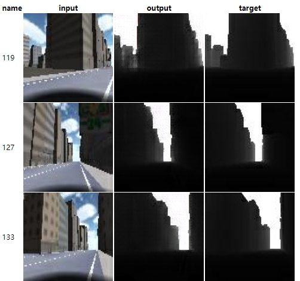

嗯，目测还行。
然后是用了几张网上的城市风景图。

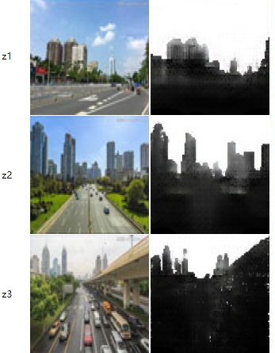

嗯，些微有些微妙。
粗略来看的话，第一个问题是车没有被检测到。
不过这也在意料之中。
因为我都没有车。
可恶，莫欺少年穷，等来日发达了，必要在AssetStore上买上最贵最大的车。


第二个问题是树没有检测到。
这个就更在意料之中了。
因为我的树，是二次元的。

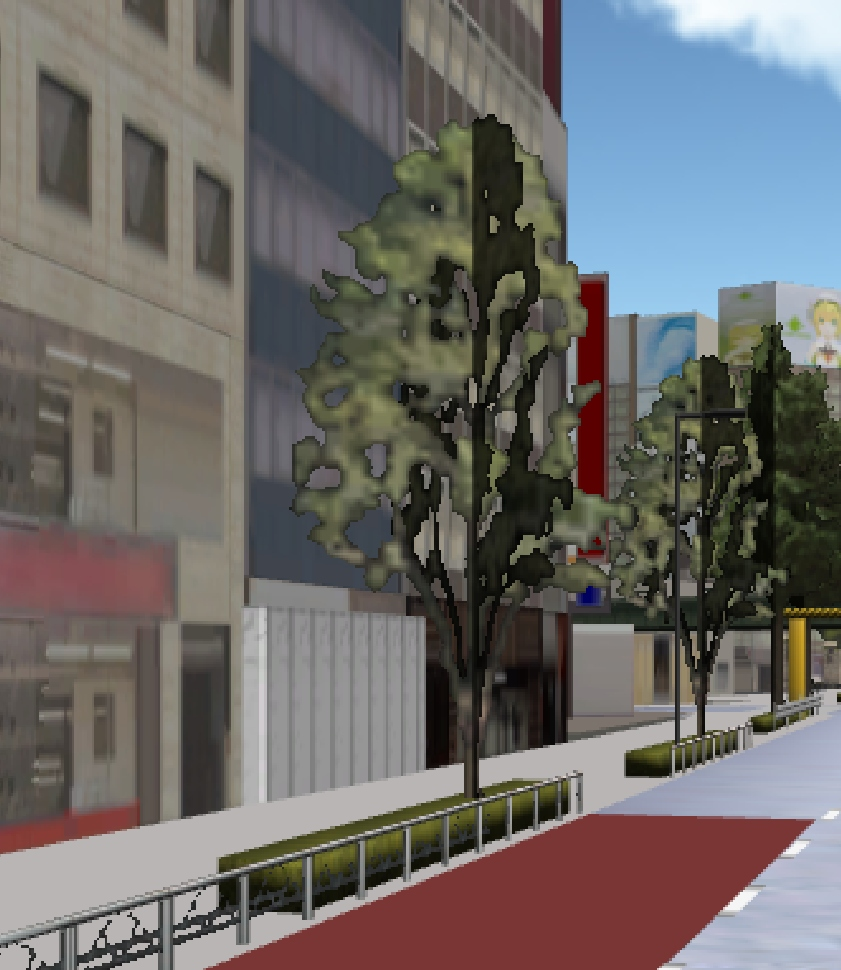

可恶，莫欺少年穷，等来日发达了，必要在AssetStore上买上最贵最大的树。

最后，用了个我自己在路上录制的视频。下面就是训练后的模型对实际照片的效果，左图是原视频，右图是深度图。方框里的红字表示深度，其实就是右图的灰度值啦。随着我人前进，数值有微妙的变化，能做到这点我感觉还挺不错的了。


## 尾
在我印象里，Unity很早就开始推机器学习的东西了。当时办了用ml-agent的游戏比赛，现在ml-agent都能产品化了，今天还在公众号上看到了[《训练适应性极强的机器学习模型？合成数据：模拟现实的无限可能》](https://unity.cn/projects/xun-lian-gua-ying-xing-ji-qiang-de-ji-qi-xue-xi-mo-xing-he-cheng-shu-ju-mo-ni-xian-shi-de-wu-xian-ke-neng )
这篇文章。属实给力。

unity+机器学习肯定是可以产生很不错的效果的。
但是当你想要把一些酷炫的东西用在游戏上，就不那么简单了。

性能问题（很多论文里的酷炫东西都是无优化硬上的），泛化问题（论文上看着很酷炫，自己跑来各种诡异），训练耗时问题（1060馋哭了）。怀着过高期待去做，可能会碰壁。

但整体来说，我觉得是值得期待的。因为在游戏的性质上，从带来一个新体验的角度的方面来说，一些奇怪的表现也许会带来更有意思的体验。换句话说，在游戏中的机器学习相比与现实世界的机器学习，人们的接受度应该会更高一点。但把新技术转换成游戏的乐趣，中间肯定需要很多想象与设计的。

在游戏中使用机器学习是个蛮需要想象力的工作。但就是这一点，才让人觉得最有趣不是吗？


## 参考
[Adobe黑科技视频](https://www.bilibili.com/video/BV1Vk4y1k7Lj?t=333 )

[Adobe黑科技](https://zhuanlan.zhihu.com/p/90895846 )

[Image-to-ImageTranslationwithConditionalAdversarialNetworks](https://arxiv.org/abs/1611.07004 )

[pix2pix](https://github.com/affinelayer/pix2pix-tensorflow )


